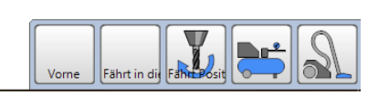

# Erklärung der angelegten Macros

Die Macros sind auf dem Bildschirm unten/rechts angeordnet.

  

1. **VORNE** - fährt die Z-Achse hoch, den Fräser in die Parkposition vorne/inks und  setzt X- , Y- und Z-Achsen auf '0'
1. **MITTE** - fährt die Z-Achse hoch und den Fräsmotor in die Mitte der Arbeitsfläche
1. **Fahre in Wechselposition** - (wie in 1.) **ohne die Achsen zu nullen**
1. **Kompressor einschalten** - aktiviert die Drucklufterzeugung
1. **Staubsauger einschalten**

[Zurück](startcontroller.md)
