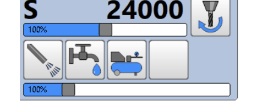

# Minimalmengenschmierung

Bildschirm unten links

  

 

1. Erste (linke) Taste - Aktivieren der Minimalmengenschmierung
1. Zweite Taste - Schmiermittel (ohne Druckluft) zum entlüften
1. Dritte Taste - nur nur Druckluft
1. Vierte Taste - MMS-Pulsbetrieb

[Zurück](startcontroller.md)
