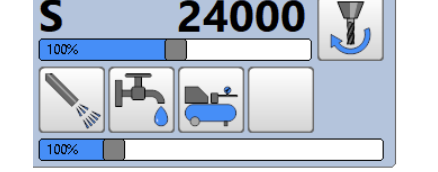

# Minimalmengenschmierung

Bildschirm unten links

  

1. (linke) Taste - Aktivieren der Minimalmengenschmierung
1. Taste - Schmiermittel (ohne Druckluft) zum entlüften
1. Taste - nur Druckluft
1. Taste - MMS-Pulsbetrieb

Wenn keine Druckluft/Schmiermittel aus dem Messingrohr kommt, Druckentlastungsventil am Schmiermittelvorratsbehälter prüfen!
[Zurück](startcontroller.md)
