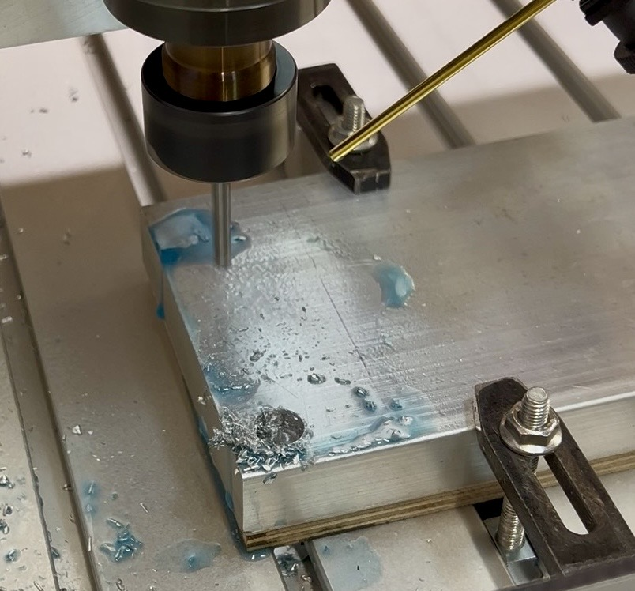

# Opfermaterial

Das Alu-Rohmaterial ist **immer** auf einem Opfermaterial zu spannen. Dafür eignen sich dünne Siebdruck- oder Multiplexplatten, die auf das Maß des Werkstücks gesägt wurden.

[Zurück zum Start](https://makerspace-wi.github.io/Project-CNC-3/#vorbereitung)
