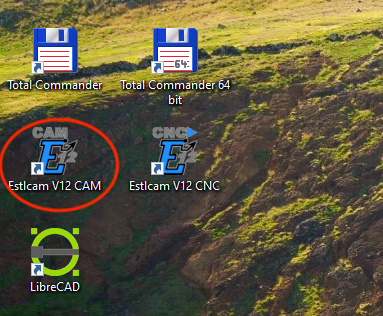
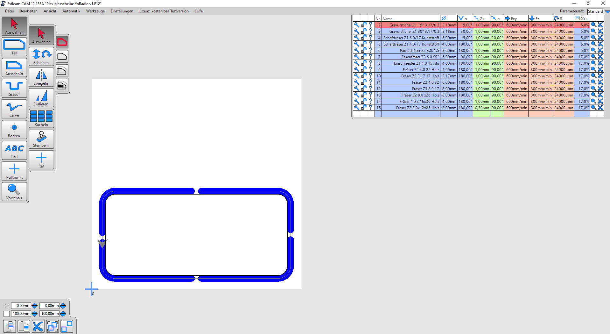
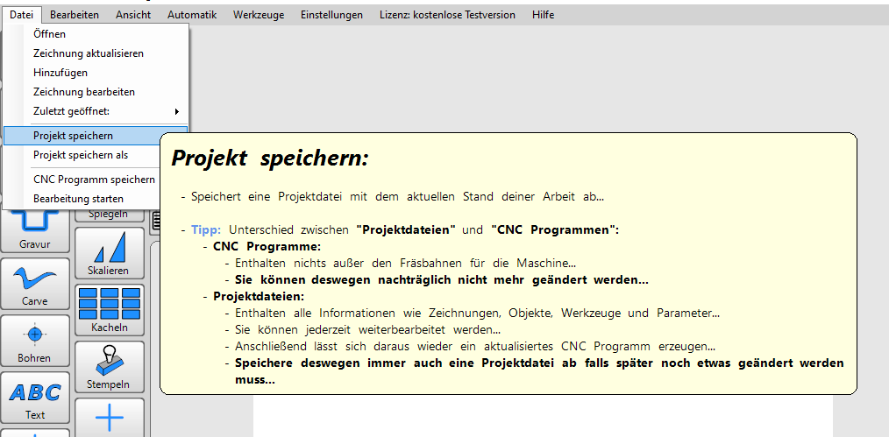
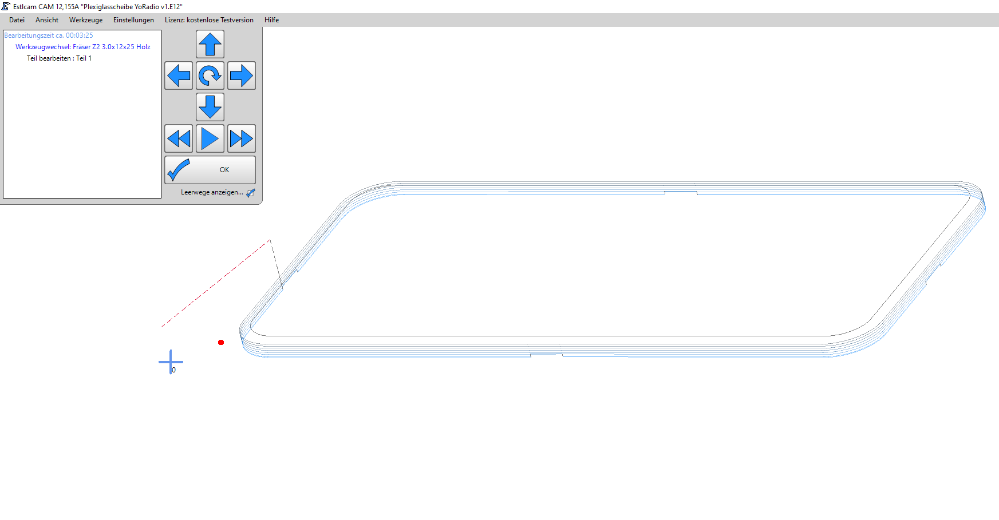

# CAM-Controller starten und Projektfile anlegen

*Jeder kann sich eine Demo-Version der aktuellen [ESTLCAM Software](https://www.estlcam.de/) zu Hause auf seinem Windows-Rechner installieren, um ESTLCAM zu studieren und/oder die eigene Werkzeugliste anzulegen. 
Apple Nutzer können gerne das installierte ESTLCAM auf dem Rechner im Elektronikraum nutzen.*

Hinweis: Jedes Feld, jede Funktion wird auf dem Bildschirm ausführlich erklärt, wenn man den Mauszeiger darüber positioniert.  

Nach Start des CAM-Modules wird folgender Bildschirm angezeigt, immer mit der Standard Werkzeugliste.

  

## Voraussetzungen und Annahmen

- der Nutzer hat sich bereits ***intensiv*** mit allen von ESTLCAM zur Verfügung gestellten Funktionen auseinander gesetzt (wird während der Einweisung geprüft!)
- der Nutzer ist im Besitz eines dedizierten USB-Sticks
- der Nutzer hat sich ein eigenes Set an benötigten Fräsern angeschafft (Einweisung ggf. mit vorhandenen Fräsern)
- der Nutzer hat seine 2D- (DXF oder SVG) oder 3D-Zeichnung (STL) erstellt und auf dem USB-Stick gespeichert

Jeder Neuling muss zuerst alle Fräserparameter des eigenen Fräsersets in die Werkzeugliste eintragen.

[Werkzeugliste anlegen](werkzeugliste.md)

Ist dies geschehen, unbedingt die Werkzeugliste auf dem eignen USB-Stick mit eindeutigem Namen abspeichern, damit sie bei weiteren Nutzungen wieder geladen werden kann.  

Also **immer** zu Beginn eines neuen Projekts <u>zuerst</u> die zu bearbeitende Zeichnung und erst dann die eigene Werkzeugliste laden, oder die Projektliste eines bereits begonnenem Projekts öffnen (dabei wird dann die korrekte Werkzeugliste angezeigt).

An dieser Stelle wird definiert, was, wie und mit welchem Fräser gearbeitet werden soll (Aussenkanten, Ausschnitte, Taschen, Gravuren, Bohren, Texte setzen, Projektnullpunkt usw.). Dies wird bei der Einweisung an einem einfachen Projekt praktiziert und erfordert jede Menge Eigeninitiative alle ESTLCAM Funktionen zu verstehen und anzuwenden.

Am Ende dann im Menü Datei '***Projekt speichern***' wählen, dabei wird dann auch die genutzte Werkzeugliste für dieses Projekt gespeichert. 

Die Projektdatei ist die wichtigste Datei, da sie alle Details enthält und auch spätere Änderungen zulässt.

An dieser Stelle dann unbedingt die Vorschau starten - es wird dann eine Frässimulation angezeigt. 

Ziel sollte es sein, das komplette Projekt mit einem Fräser abzuarbeiten, da die CNC-3 keinen Werkzeugwechsler hat. 
Bei Projekten mit unterschiedlichen Fräsern wird zum Werkzeugwechsel die Maschine angehalten und muss nach Fräserwechsel und Z-Achsennullung wieder gestartet werden.  

Bevor das ESTLCAM CNC Modul gestartet wird 
[Zurück zum Start](https://makerspace-wi.github.io/Project-CNC-3/#hilfestellungen-zum-fr%C3%A4sjob)