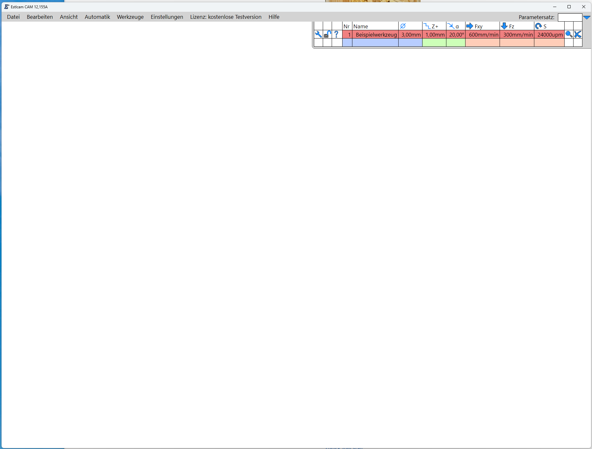

# CAM-Controller starten und Projektfile anlegen

Hinweis: Jedes Feld, jede Funktion wird auf dem Bildschirm ausführlich erklärt, wenn man den Mauszeiger darüber positioniert.  

## Voraussetzungen und Annahmen

- der Nutzer hat sich bereits ***intensiv*** mit allen von ESTLCAM zur Verfügung gestellten Funktionen auseinander gesetzt (wird während der Einweisung geprüft!)
- der Nutzer ist im Besitz eines dedizierten USB-Sticks
- der Nutzer hat sich ein eigenes Set an benötigten Fräsern angeschafft
- der Nutzer hat seine 2D- (DXF oder SVG) oder 3D-Zeichnung (STL) erstellt und auf dem USB-Stick gespeichert

Jeder Neuling muss zuerst die Werkzeugliste (oben/rechts) an das eigene Fräserset anpassen, d.h. dort alle Fräserparameter eintragen. In etwa so:

Ist dies geschehen, unbedingt die Werkzeugliste auf dem eignen USB-Stick mit eindeutigem Namen abspeichern, damit sie bei der nächsten Nutzung wieder geladen werden kann.  
**VORSICHT:** Nach Aufruf des CAM-Controllers, zeigt Estlcam immer die zuletzt genutzte Werkzeugliste an, d.h. die vom letzten Benutzer.

[Zurück zum Start](https://makerspace-wi.github.io/Project-CNC-3/#hilfestellungen-zum-fr%C3%A4sjob)werkzeuglistes