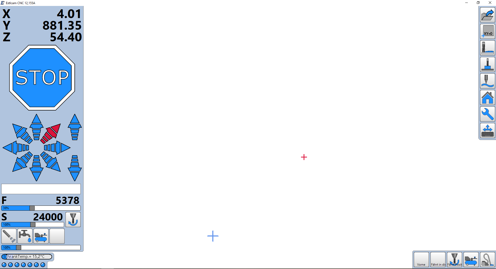

# CNC-Controller starten

Hinweis: Jedes Feld, jede Funktion wird auf dem Bildschirm ausführlich erklärt, wenn man den Mauszeiger darüber positioniert.

  

[Zurück zum Start](https://makerspace-wi.github.io/Project-CNC-3/#hilfestellungen-zum-fr%C3%A4sjob)
