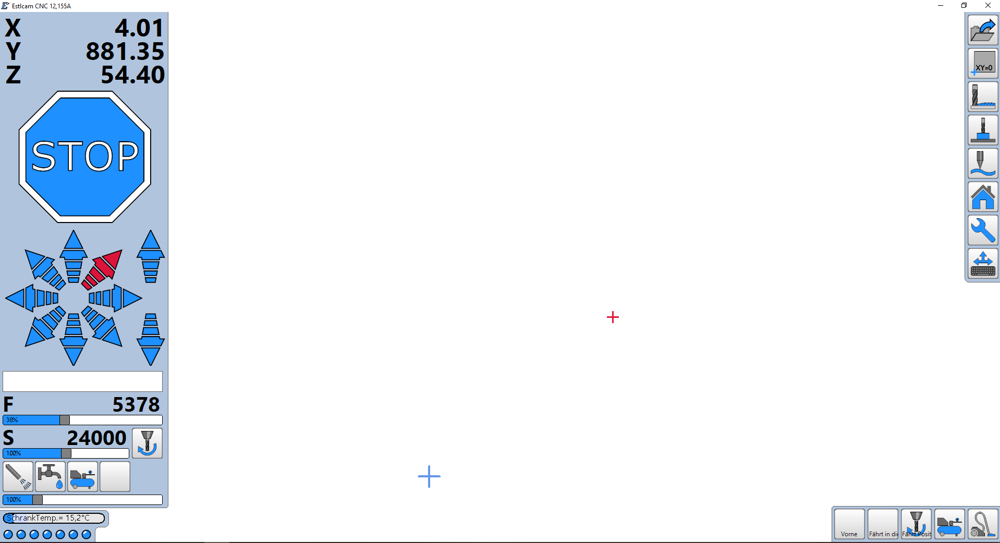

# CNC-Controller starten

 

Der CNC-Controller wird durch Doppelklick von **Estlcam V12 CNC** auf der Oberfläche gestartet, damit werden alle Achsentreiber aktiviert, d.h. der Fräsmotor kann ab jetzt mittels Fernsteuerung, Maus oder Direkteingabe an eine Position fahren.

**Hinweis:** Jedes Feld, jede Funktion wird auf dem Bildschirm ausführlich erklärt, wenn man den Mauszeiger darüber positioniert.

## HILFE! - Ich habe eine Achse in den Endstopp gefahren 😱

Wenn dies passiert ist - bitte einfach die Ruhe bewahren! Die Software hat sofort alle Bewegungen gesperrt und am unteren Rand des Bildschirms wird auch darauf hingewiesen (in roter Schrift & blinkend). In diesem Fall die 'F11' Taste gedrückt halten und die betroffene Achse **manuell aus dem Endstopp** fahren (bei gedrückter F11-Taste darauf achten, dass in die richtige Richtung gefahren wird, also weg vom Endstopp).

[Funktionen Fernsteuerung](fernsteuerung.md)

[Steuerung per Maus & Tastatur (YouTube Video)](https://www.youtube.com/watch?v=sXvNqufWKvA)

[Macros](macros.md)

[Minimalmmengenschmierung (MMS)](mms.md)

[Zurück zum Start](https://makerspace-wi.github.io/Project-CNC-3/#hilfestellungen-zum-fr%C3%A4sjob)