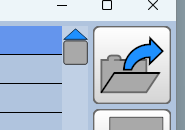
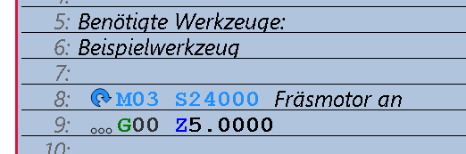
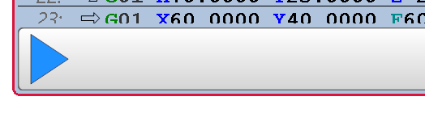
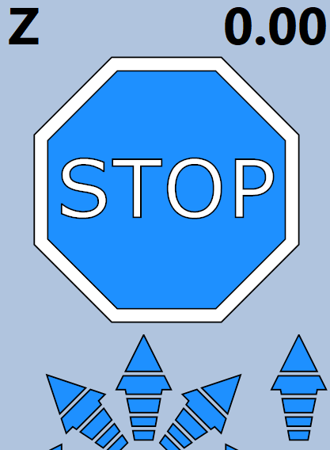

# Fräsjob starten  

1. **Projekt/Fräsfile muss in ESTLCAM geladen sein.**  
  
 
1. **Die angezeigte Spindeldrehzahl und der zu nutzende Fräser wird angezeigt und sollte unbedingt nochmals geprüft werden.**  
  
 
1. **Der Fräsjob wird nach dem Betätigen des Dreiecks gestartet.**  
  
 
1. **Das Programm kann jederzeit angehalten werden und zwar durch**  
    - nochmaliges Drücken der Starttaste  
    - Bestätigen des großen STOP-Buttons (färbt sich rot mit Maus)  
      
    - Drücken der Escape(Esc) Taste auf der Tastatur  
 
[Zurück zum Start](https://makerspace-wi.github.io/Project-CNC-3/)
