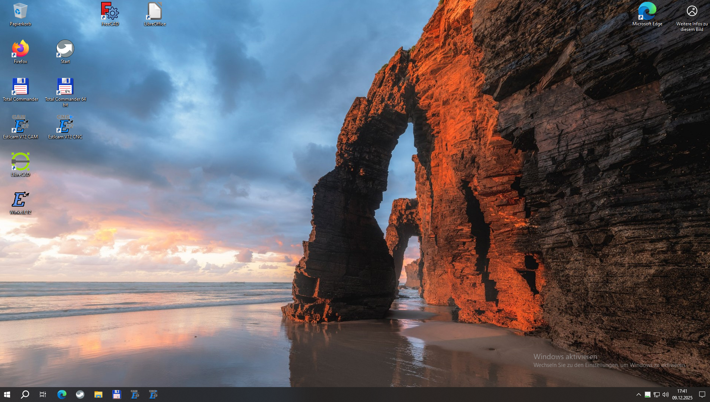
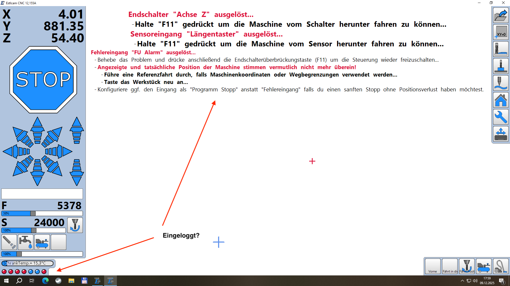

# CNC-3 einschalten und mit RFID-Chip anmelden
- zuerst sicherstellen, dass die CNC-3 an das Stromnetz angeschlossen ist  

  

- den Hauptschalter auf "ON" schalten und prüfen, dass der NOT-AUS und der "NOT-STOP" nicht gedrückt sind  

  

- Nach dem 'booten' zeigt sich der Desktop mit Startbildschirm  

- mit RFID-Chip die CNC-3 aktivieren - setzt voraus, dass das Mitglied freigeschaltet ist.  
Gelegentlich kann es sein, dass das Lesegerät den Chip nicht erkennt, dann - und nur dann - den kleinen roten RESET-Button drücken und abwarten, bis sich die CNC-3 mit unserem Zugangssystem synchronisiert hat. Danach sollte der Chip ohne Probleme erkannt werden.  

  

Falls versäumt wurde sich einzuloggen, erscheint folgender Bildschirm nach starten des CNC-Programms:  

- Das Programm ***ESTLCAM *** mit Doppelklick starten - du erhältst folgenden Startbildschirm:  

  

***Bitte unbedingt beachten !***  

**Die Frässpindel muss immer vor den Fräsarbeiten ohne Last ca. 3 Minuten bei 6000 U/min warm laufen!**  

[Zurück zum Start](https://makerspace-wi.github.io/Project-CNC-3/)