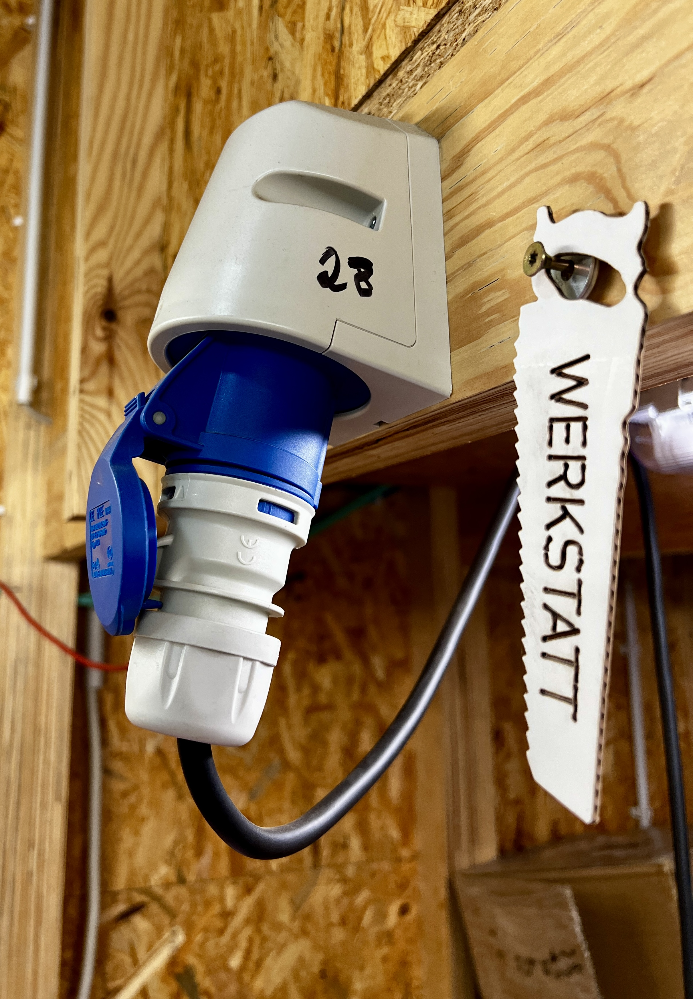
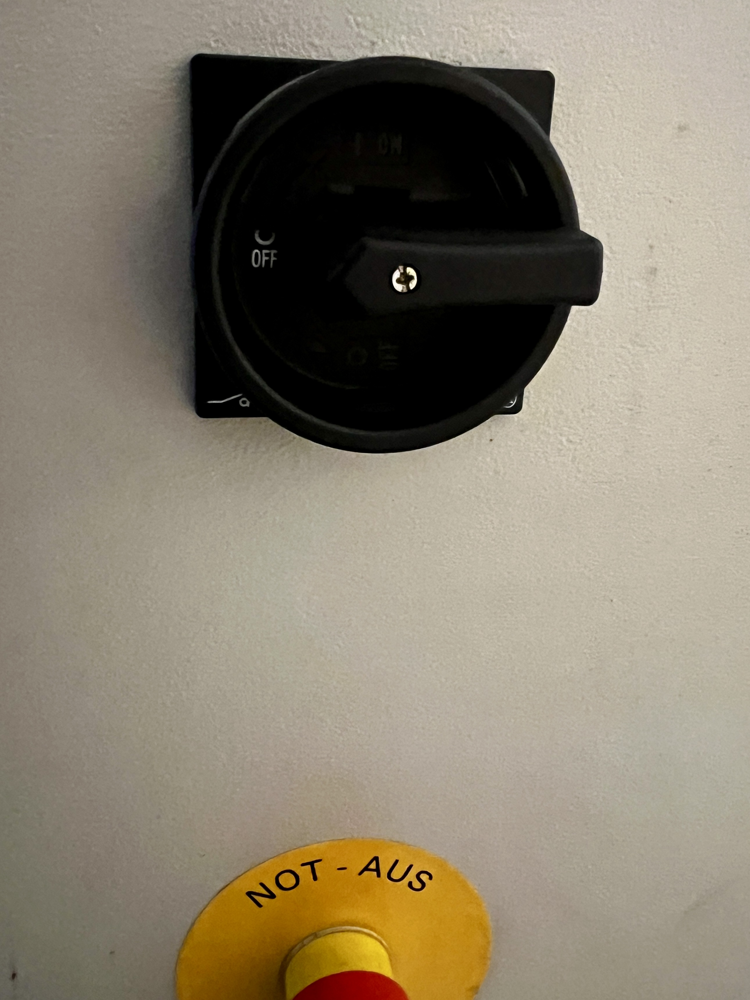
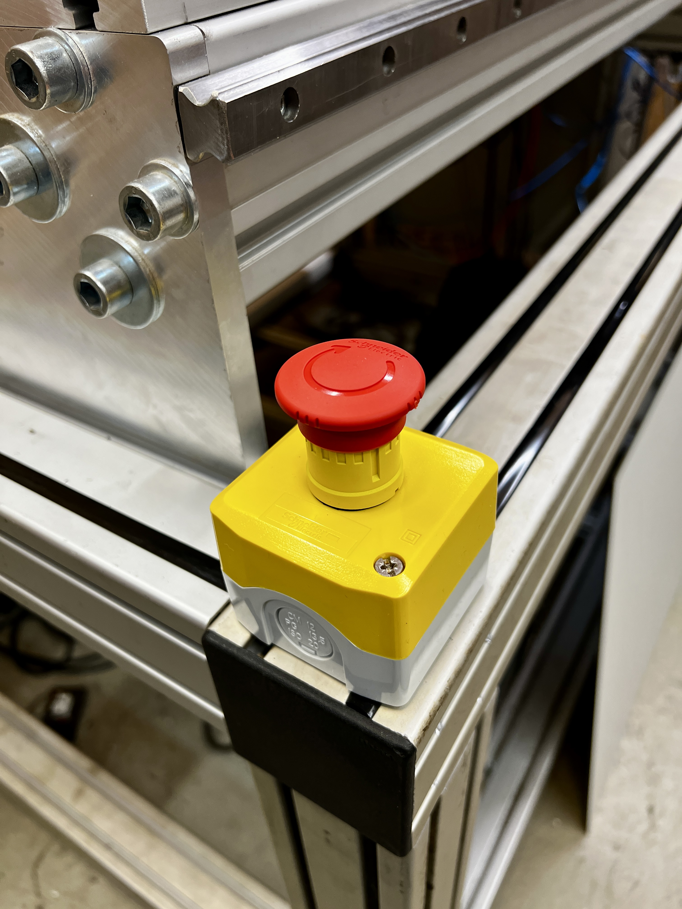

# CNC-3 einschalten und mit RFID-Chip anmelden
- prüfen, ob die CNC-3 an das Stromnetz angeschlossen ist  
 
- den Hauptschalter auf "ON" schalten und sicherstellen, dass der NOT-AUS nicht gedrückt ist  
 
- prüfen, dass der "NOT-STOP" nicht gedrückt ist  
 
 
[Zurück zum Start](https://makerspace-wi.github.io/Project-CNC-3/)