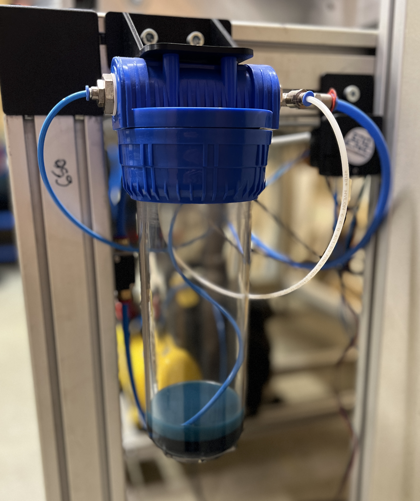

# Schmiermittelstand prüfen

Falls der Schmiermittelstand im Vorratsbehälter unter der aufgeklebten Markierung ist, ***auf keinen Fall*** selbst nachfüllen, sondern das Technikteam informieren (Michael M. -  Holger G. - Dieter H. - Elian T. - Orlando E.)

[Zurück zum Start](https://makerspace-wi.github.io/Project-CNC-3/#vorbereitung)
