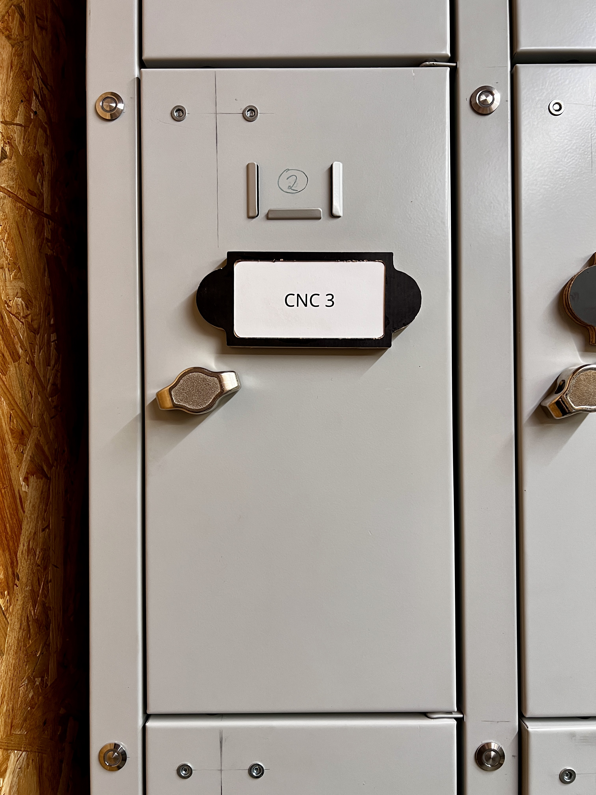
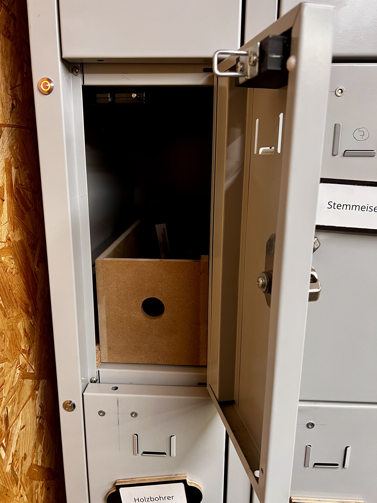
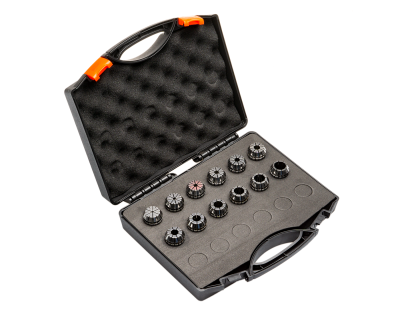

# Toolslocker Zubehörbox  

Die Box im TOLO-2 beinhaltet alle notwendigen Zubehörteile wie Spannmutter, Spannzangen, Spannschlüssel, Hakenschlüssel, Konuswischer, Reinigungspinsel, T-Nutenmuttern usw. 

- <a href="https://www.upload.sorotec.de/doku/manuals/Merkblatt_Spannzangenwechsel.pdf" target="_blank">Merkblatt_Spannzangenwechsel</a>

  

### Spannzangenset ER 20 12teilig Grössen: 2 ... 13 mm in 1 mm-Schritten plus Spannzange ER20 3,175 mm 

[Zurück zum Start](https://makerspace-wi.github.io/Project-CNC-3/#vorbereitung)
