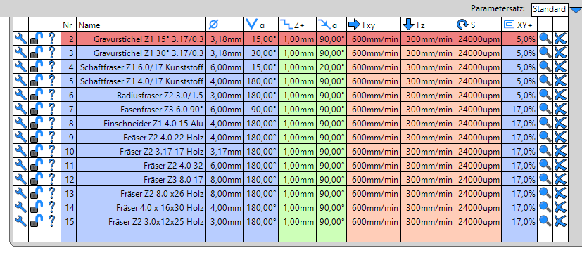

# Werkzeugliste

Die gezeigte Werkzeuglist ist lediglich ein Beispiel - die eigene Werkzeugliste sieht mit Sicherheit anders aus.

   

Die folgenden Links unterstützen Euch beim anlegen der Werkzeugliste:  

- <a href="https://www.youtube.com/watch?v=hAuFUJFVQ4M" target="_blank">Die Listenansicht</a>
- <a href="https://www.youtube.com/watch?v=ulKHbmKEAJ8" target="_blank">Die Werkzeug Detailansicht</a>
- <a href="https://www.youtube.com/watch?v=FUI7nvCAFAw" target="_blank">Parametersätze</a>

Die Werkzeugliste kann auch Bilder der Fräser abspeichern und später anzeigen. Die jeweiligen Bild-Dateien können bei Sorotec oder HC-Maschinentechnik kopiert werden.  

Interessant ist es auch, sich mit dem Export als .csv Datei zu beschäftigen. Diese kann dann bequem in einem Tabellenprogramm bearbeitet werden.
 
[Zurück zum Start](https://makerspace-wi.github.io/Project-CNC-3/startcam.html#voraussetzungen-und-annahmen)